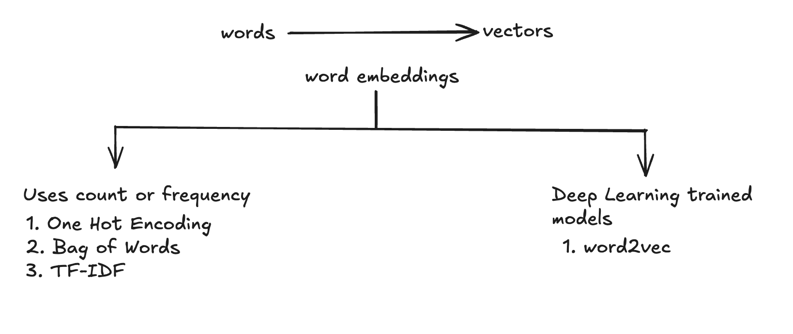

# Chapter 10: Machine Learning for NLP

## Practical uses of NLP

1. Grammar/Spelling correction in word editors (in email or other places)
2. Automated reply recommendations on Linkedin
3. Language Translation in Google Translate or See Translation features in Social Media
4. Search Engines heavily rely on NLP
5. Smart assistants like Alexa or Google agent

## Tokenisation in NLP

### Topics to Cover

1. Corpus - A paragraph usually called a corpus
2. Documents - A document usually consists of sentences.
3. Vocabulary - All the _unique words_ present in the paragraph
4. Words

---

Let us consider the following corpus:

"My name is Vedansh, and I am currently studying tokenisation, which is a very important topic for NLP. Apart from this I love to travel."

Tokenisation is the process where we convert corpus or documents into tokens. So, if we perform tokenisation on the above corpus it becomes,

Tokenisation(corpus) => sentences => ["My name is Vedansh, and I am currently studying tokenisation, which is a very important topic for NLP", "Apart from this I love to travel"]

When we tokenise a corpus, we get sentences. And when we tokenise sentences, we get words.

Tokenisation(sentences) => words => ["My", "name", "is", "Vedansh", "and", "I", "am", "currently", "studying", "tokenisation", "which", "is", "a", "very", "important", "topic", "for", "NLP", "Apart", "from", "this", "I", "love", "to", "travel"]

---

Let us consider another example:

corpus = "I like to drink apple juice. My friend like mango juice"
sentences = tokenisation(corpus) = ["I like to drink apple juice", "My friend like mango juice"]
words = tokenisation(sentences) = ["I","like","to","drink","apple","juice","My","friend","like","mango","juice"]

count(words) = 11
count(unique_words) = 9 => this is called vocabulary

## Stemming in NLP

Stemming is the process of reducing a word to it's word's stem. For instance, stemming(eating) = eat, stemming(dancing) = dance
This is usually important in problem statements, where we let's say want to perform sentiment analysis of a movie review, and we want to treat "love" and "loving" as the same word.

## Lemmatisation in NLP

When we perform stemming, for some words, we do not get the expected results (the result may change the meaning of the word entirely or in some cases give meaningless results, for example: 'history' becomes 'histori'). Lemmatization is very much like stemming. The outputs that we get from lemmatisation is called 'lemma' while stemming yields 'word stems'. Lemma is the root word and not the root stem. Lemmatisation guarantees that we get valid words that have the same meaning.

Compared to Stemming, Lemmatisation is slower.

## Stopwords in NLP

Certain words like I, are, is, that, their etc do not play any significant role in determining the meaning of the sentence. For example, in the sentence: "I need a DevOps engineer to make an existing Swiss healthcare app run entirely without Supabase Cloud." These needs to be removed from the texts to keep the significant words only (depends on usecase).

## Parts of Speech Tagging in NLP

In the lemmatisation, we observed that parts of speech tagging is a very crucial process, since the output got affected based on the part of the speech we used to provide in the WordNetLemmatizer (as the pos argument).

## Named entity recognition

Named Entity Recognition (NER) is a subtask of information extraction that seeks to locate and classify named entities mentioned in unstructured text into pre-defined categories such as persons, organizations, locations, medical codes, time expressions, quantities, monetary values, percentages, etc.

Named entity recognition (NER) is the process of identifying and categorizing key information (entities) in text.

## Steps for solving NLP Problems

Lets say we want to solve a sentiment analysis problem. To solve it we would have lets say a corpus. We would take the following steps

#### Text Preprocessing

- Tokenisation
- Lowercase conversion
- Regular Expression
- Stemming
- Lemmatisation
- Stopwords
- Convert text to vectors
- Train the ML model

## Text to vector conversions

We need to convert text data to vector data in order to feed it to Machine Learning models. These are some of the ways:

1. One-Hot Encoding
2. Bag of words (BOW)
3. TF-IDF
4. word2vec
5. Average word2vec

## One Hot Encoding

One-Hot Encoding is no longer being used in NLP usecases, but it is important to understand

So let us consider three statements:

S1 -> The food is good
S2 -> The food is bad
S3 -> Pizza is amazing

Now, the unique vocabulary in the above statements are

<!-- Voca.       The     food    is    good     bad     Pizza   amazing
The           ->  1       0       0      0       0           0       0
Food          ->  0       1       0      0       0           0       0
is            ->  0       0       1      0       0           0       0
Good          ->  0       0       0      1       0           0       0
Bad           ->  0       0       0      0       1           0       0
Pizza         ->  0       0       0      0       0           1       0
Amazing       ->  0       0       0      0       0           0       1 -->

Now, the Statements can be represented as

S1 -> [[1, 0, 0, 0, 0, 0, 0], [0, 1, 0, 0, 0, 0, 0], [0, 0, 1, 0, 0, 0, 0], [0, 0, 0, 1, 0, 0, 0]]
S2 -> [[1, 0, 0, 0, 0, 0, 0], [0, 1, 0, 0, 0, 0, 0], [0, 0, 1, 0, 0, 0, 0], [0, 0, 0, 0, 1, 0, 0]]
S3 -> [[0, 0, 0, 0, 0, 1, 0], [0, 0, 1, 0, 0, 0, 0], [0, 0, 0, 0, 0, 0, 1], [0, 0, 0, 1, 0, 0, 0]]

This is how we convert words to vector using one-hot encoding.

### Advantages and Disadvantages of OHE

#### Advantages

1. Easy to implement in Python
2. Since we have fixed the size of the vectors (based on the vocabulary), we can easily store the data in a 2D matrix or DataFrame

#### Disadvantages

1. Size of vector increases with the number of documents (vocabulary size) [Sparse Matrix gets created which results in overfitting]
2. No semantic meaning is captured. For example, if we add "pizza" in our corpus, the vector for "pizza" will be completely different from "burger", even though they are similar
3. If we add new words to the corpus, we need to regenerate the entire vector space

## Bag of Words (BOW)

This is a simple technique that can be used for small-text problem statements. Some of the popular usecases are spam-classification, review analysis, etc. To understand this technique let us consider the following statements:

S1 -> He is a good boy.
S2 -> She is a good girl.
S3 -> Boy and girl are good.

Step 1: We will make the text lowercase.
Step 2: Eliminate Stopwords

This makes the statements as follows:

S1 -> [good, boy]
S2 -> [good, girl]
S3 -> [boy, girl, good]

Now our vocabulary has 3 words. We can create a frequency distribution table (sorted in descending order of frequency) as follows:

good -> 3
boy -> 2
girl -> 2

In a bigger dataset, we can have more words in the vocabulary. There can be some words which are present only once, we can select the top 10-20 words based on the dataset. Now statements can be represented as follows:

S1 -> [1, 1, 0]
S2 -> [1, 0, 1]
S3 -> [1, 1, 1]

Here the vector is representing [good, boy, girl]
If we compare the implementation with that of One-hot Encoding, we would see how simple it was to convert statements to vectors (the size is also small). Also, the BOW (Bag of words) can be either binary or non-binary in nature. In binary-BOW, the vectors will have 0-1 depending on presence of the word, whereas, in binary-BOW, the vector will contain frequency of the occurance of the word in the sentence.

#### Advantages

1. Easy to implement.
2. Output is of fixed-size (Good for ML algorithms).
3. Captures frequency of the words (Better than OHE).

#### Disadvantages

1. Sparse Matrix problem (similar to OHE) that causes overfitting.
2. Does not capture semantic meaning of the words. Also the vectors that gets created may have different order of words.
3. A lot of words are going to get rejected in real-life scenarios.
4. The out-of-vocabulary issue is present in this as well.

## N-Grams (bigrams, trigrams etc)

Let us take the following sentences as examples
S1 -> The food is good
S2 -> The food is not good

Both the sentences S1 and S2 are completely different from each other.

<!-- vocabulary -> [food not good]

S1 -> [1 0 1]
S2 -> [1 1 1] -->

With respect to vectors S1 and S2 are very similar. If we make use of combinations, lets say combinations of 2 words (bigrams) or 3 words (trigrams) etc. My vocabulary will become [food, good, not, food not, not good, not good]. With this new vocabulary, the sentences S1 and S2 will become S1 -> [0, 1, 1, 0, 1, 0], S2 -> [0, 1, 1, 1, 0, 0].
This will capture more context/semantics for the sentences and improve the accuracy of the model.
The tuple is read as (x, y) where x = starting point and y = ending point (inclusive)
(1,1) -> monograms only
(1,2) -> monograms and bigrams
(1,3) -> monogram, bigram and trigrams etc
(2,3) -> bigrams, trigrams
(3,3) -> trigrams only

## TF-IDF [Term Frequency - Inverse Document Frequency]

The TF-IDF is an improvement over Bag of Words (BOW). In BOW, all words are treated equally. However, some words (like "the", "a", "is", etc.) are very common and do not contribute much to the meaning of a sentence. TF-IDF assigns a weight to each word based on its frequency in the document and its frequency in the corpus. Words that are frequent in a document but rare in the corpus get higher weights, while words that are frequent in both documents and the corpus get lower weights.

Let us consider the following 3 sentenecs"
S1 -> good boy
S2 -> good girl
S3 -> boy girl good

```
Term Frequency can be calculated as TF(t,d) = (Frequency of term t in document d) / (Total number of terms in document d)

Inverse Document Frequency can be calculated as IDF(t,D) = log(Total number of documents D / Number of documents containing term t)

TF-IDF(t,d,D) = TF(t,d) \* IDF(t,D)
```

So for words in sentences, we can calculate term frequency using the above formula

<!-- voc ->  [good         boy          girl]
S1 ->       (1 / 2)      (1 / 2)          0
S2 ->       (1 / 2)      0                 1/2
S3 ->       (1 / 3)      (1 / 3)         1/3      -->

Now we can calculate inverse document frequency using the above formula

<!-- Total no. of documents = 3

IDF(good) = log(3 / 3) = 0
IDF(boy) = log(3 / 2) = 0.176
IDF(girl) = log(3 / 2) = 0.176 -->

Now TF-IDF can be caculated as

<!--
vocabulary ->  good             boy                            girl
S1         ->  0 [1/2 x 0]      0.088 [1/2 x 0.176]               0                          -> [0, 0.088, 0]
S2         ->  0 [1/2 x 0]      0                                 0.088 [1/2 x 0.176]        -> [0, 0, 0.088]
S3         ->  0 [1/3 x 0]      0.117 [1/3 x 0.176]               0.117 [1/3 x 0.176]        -> [0, 0.117, 0.117]
 -->

#### Advantages

1. Simple and Intuitive
2. Outputs are of fixed size
3. Word importance gets captured in this technique which makes it better than OHE and BOW.

#### Disadvantages

1. This method also creates sparse-matrix
2. Out of vocabulary issue still exists in this method

## Word Embeddings



In NLP, Word Embedding is a representation of words as vectors of real numbers. It is a way to convert words into vectors of fixed size, which can be used by machine learning algorithms. The goal of word embeddings is to capture the semantic meaning of words, so that words with similar meanings have similar vector representations.

The word embeddings can be used to solve the out-of-vocabulary issue.

#### Word2Vec

##### Pre-requisite Knowledge: ANN, Loss Functions, Optimisers

Word2Vec is a technique for learning word embeddings from text data. It is a shallow neural network that can be trained to learn word embeddings from text data. There are two main architectures of Word2Vec: Continuous Bag of Words (CBOW) and Skip-gram. In CBOW, the model predicts the current word given the context words. In Skip-gram, the model predicts the context words given the current word. Word2Vec can be used to learn word embeddings from text data, which can then be used for various NLP tasks such as text classification, sentiment analysis, etc.

Each and every word in the vocabulary will be converted to a feature representation. Because of this, similar words are expressed with vectors that are near to each other. Synonyms will be expressed as vectors that are opposite to each other. To find out distance between two vectors, we can use the formula

Distance = 1 - cosine similarity(v1, v2)

Cosine Similarity is the angle between two vectors.

Word2Vec are of two types:

1. CBOW (Continous Bag of Words)
2. Skipgrams

##### Continous Bag of Words (CBOW)

Lets say we have a corpus that says "XYZ Company is related to data science and artificial intelligence".

- The first thing that we do is to select a window size. Let's say window_size=5. This is an important step to indentify input and output data. This window_size denotes the number of words that we need to select initially. So, in our case, we will select 5 words: [XYZ Company is related to]. From the selected words, we will select the word that is in the middle. Our imput and output will become in this case:

<!--
Input 	                                Output
(XYZ, company, related, to)	                (is)
(Company, is, to, data)                       (related)
.
.
.
 -->

We are creating this type of structure, so that we get to know, the forward and backword words for "IS" which will be useful for context. Similarly, we will move the window and select the next 5 words, pick the center word, identify forward and backward words. We can take any value for the window_size, however it is recommended to take an odd number.

- Once we have our inputs and outputs using the above step, we will train our model with the data. However, we need to convert the words to vectors before we use it to train the model. The corpus that we used have 10 words in the vocabulary, and lets say if we use One-Hot Encoding, then we will express each word as a vector of 10 dimensions.

- CBOW is a fully connected neural network. If we have taken our window_size=5, then we will have 4 words to be sent as input to the model where each word will be a vector of 10 dimensions, therefore, the input layer will require 40 inputs. Our hidden layer will have the same number of neurons (or inputs) as the window_size (in our case, it is 5), while the output layer will give 1 word which is denoted by a 10-dimension vector, so the output layer will have 10 neurons.

- window_size is usually determined by the feature size (number of features on which we convert the word to the vectors). Therefore each word, gets expressed as 5 feature vector, which is why our hidden layer has the same number of neurons as our window_size (or feature size). Usually the bigger the window size, the better the model performs.

##### Skipgrams

- Let us take the same example [XYZ Company is related to data science and artificial intelligence].

- The difference between CBOW and Skipgrams is that in Skipgrams we will try to predict the context words using the center word, i.e., given the word "is", we will try to predict the words [XYZ, Company, related, to].

- When we create the neural network, our input layer will have 10 neurons to denote a word encoded using OHE. There will be a hidden layer with the same number of neurons as the window_size (in our case, it is 5). Our output layer will have 40 neurons to denote the 4 words.

##### Skipgrams vs CBOW

- Whenever we have a small corpus, we should use CBOW. If the dataset is huge, then we should use skipgrams.

##### Good Practices to improve CBOW or Skipgram window size

- Increase training data
- Increase window size (more vector dimensions)

##### Advantages of word2vec

1. We get dense matrix, so the problem of sparse matrix (that used to cause overfitting) is solved.
2. Semantic Info is getting captured.
3. We get a fixed set of dimensions
4. Out of vocabulary issue is also eliminated to a great extent

#### Average word2vec

Lets consider the following documents:

<!--

Doc        Text             Output
D1 -> The food is good          1
D2 -> The food is bad           0
D3 -> Pizza is amazing          1

 -->

With word2vec, we take every word and we convert them to vectors. So each of the words across the docs will get converted to vectors of 300 dimensions. Now, we have vectors for each of the words, but we can get 1 vector of 300 dimensions, that expresses the document. That way, we can feed our model and train it. With average word2vec, we can take the average of all the words in the document, calculate average of each dimension and store it in a new vector.
