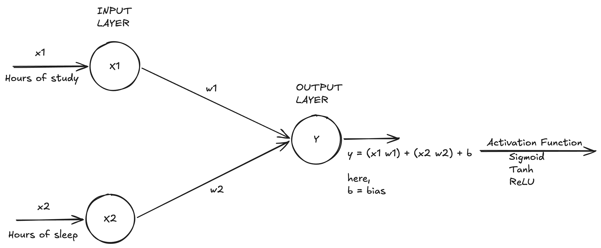

# Artificial Neural Networks (ANNs)

This mimics how the brain functions. ANNs comprises of the following components:

1. Neurons (Nodes)
2. Layers
3. Connections
4. Activation Functions

## Neurons

This is simplest unit of an ANN. It is capable to store some information/data within it. Neuron also has two components:

1. Input Values (Xi) - These are the input values that are fed to the neuron
2. Weights (Wi) - These are the weights that are applied to the input values
3. Bias (Bi) - This is the bias that is added to the weighted sum of input values
4. Output (Oi) - This is the output value that is produced by the neuron

## Layers

We usually have multiple layers in an ANN, however we can break it into the following:

1. Input Layer - Responsible to take input
2. Hidden Layers - Responsible for calculations and computations
3. Output Layer - Responsible to give the final output

## Connections

All the layers are connected to each other. Each neuron in a layer is connected to all the neurons in the next layer. These connections are the reason that neural networks are able to learn complex patterns and relationships in data. Each connection will have a weight and bias associated to it.

## Activation Functions

We usually get non-linear values as outputs (eg. 10, 10000, 2, 0.5, 50 etc). To make this output in a linear format, we make use of activation functions.

